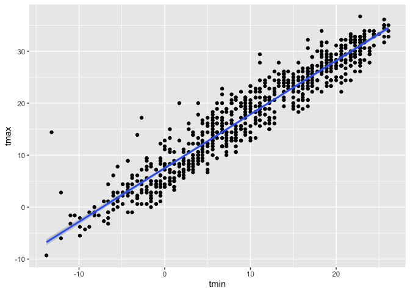

iteration_and_listcols
================
2025-10-28

``` r
library(tidyverse)
```

    ## ── Attaching core tidyverse packages ──────────────────────── tidyverse 2.0.0 ──
    ## ✔ dplyr     1.1.4     ✔ readr     2.1.5
    ## ✔ forcats   1.0.0     ✔ stringr   1.5.1
    ## ✔ ggplot2   3.5.2     ✔ tibble    3.3.0
    ## ✔ lubridate 1.9.4     ✔ tidyr     1.3.1
    ## ✔ purrr     1.1.0     
    ## ── Conflicts ────────────────────────────────────────── tidyverse_conflicts() ──
    ## ✖ dplyr::filter() masks stats::filter()
    ## ✖ dplyr::lag()    masks stats::lag()
    ## ℹ Use the conflicted package (<http://conflicted.r-lib.org/>) to force all conflicts to become errors

``` r
library(rvest)
```

    ## 
    ## Attaching package: 'rvest'
    ## 
    ## The following object is masked from 'package:readr':
    ## 
    ##     guess_encoding

## Make a list

``` r
#this has to be a list, can't be a dataframe, because each vector is of different length
l = 
  list(
    vec_numeric = 1:23,
    char_vec = c("Rachel"),
    mat = matrix(1:8, nrow = 2, ncol = 4),
    summary = summary(rnorm(1000, mean = 4))
  )

l
```

    ## $vec_numeric
    ##  [1]  1  2  3  4  5  6  7  8  9 10 11 12 13 14 15 16 17 18 19 20 21 22 23
    ## 
    ## $char_vec
    ## [1] "Rachel"
    ## 
    ## $mat
    ##      [,1] [,2] [,3] [,4]
    ## [1,]    1    3    5    7
    ## [2,]    2    4    6    8
    ## 
    ## $summary
    ##    Min. 1st Qu.  Median    Mean 3rd Qu.    Max. 
    ##   1.237   3.348   4.077   4.049   4.735   7.164

``` r
l[[1]] #gives just the first vector
```

    ##  [1]  1  2  3  4  5  6  7  8  9 10 11 12 13 14 15 16 17 18 19 20 21 22 23

``` r
l[["vec_numeric"]] #call it by name and get it returned
```

    ##  [1]  1  2  3  4  5  6  7  8  9 10 11 12 13 14 15 16 17 18 19 20 21 22 23

``` r
l$mat #another way of pulling stuff out, not the most preferred way
```

    ##      [,1] [,2] [,3] [,4]
    ## [1,]    1    3    5    7
    ## [2,]    2    4    6    8

## Make a different list

``` r
list_normals = 
  list(
    a = rnorm(30, mean = 3, sd = 1),
    b = rnorm(30, mean = 30, sd = 1),
    c = rnorm(30, mean = 3, sd = 10),
    d = rnorm(30, mean = -3, sd = 4)
  )

list_normals
```

    ## $a
    ##  [1] 2.7515967 2.3983800 4.0781143 3.7153934 3.6678092 4.7778224 3.1119581
    ##  [8] 3.3417571 2.2006441 3.4603914 3.2465313 1.7788168 3.0349183 2.9259004
    ## [15] 2.6650264 3.5260444 0.4536381 3.8131838 2.4506897 3.0055782 2.1314677
    ## [22] 3.8701967 3.1192533 4.3591225 3.6828990 2.2735834 4.5860545 3.6602626
    ## [29] 3.1567288 1.8490001
    ## 
    ## $b
    ##  [1] 29.98735 28.99825 31.01982 29.69312 32.18292 32.02953 29.96572 28.61178
    ##  [9] 29.70180 28.64905 30.59261 31.21347 30.58099 30.79516 28.78687 31.05916
    ## [17] 29.83016 27.87054 27.97413 30.02498 29.18728 29.89761 28.44125 30.44547
    ## [25] 28.35670 28.94529 29.61212 29.17873 30.05956 30.35595
    ## 
    ## $c
    ##  [1]   7.84059761  -5.36323139  -5.14267505  23.18181176   9.73660862
    ##  [6]   9.46808976   7.21057149   7.76825650   7.11149568   0.01296268
    ## [11] -10.01418270  15.54112081  -1.69546038  10.23970414  17.30632554
    ## [16]  -4.97148677  -0.25742867 -11.26172522   4.40040803 -14.97412903
    ## [21]   8.69193156   3.01729488  12.26315612  -1.09784115 -12.32438732
    ## [26]   7.01467071  25.73584397  -1.47290998  10.23777417  -0.53405538
    ## 
    ## $d
    ##  [1]  6.821992366  2.353150707 -1.121849298 -7.300418275 -7.104641433
    ##  [6] -1.021132749 -4.573911681 -4.770740901 -5.011955595 -6.851508049
    ## [11] -3.813207114 -2.930676895 -3.647747149  5.224915574 -1.224479364
    ## [16]  0.300843439  0.003860095 -8.474488362 -4.573360902  0.123904943
    ## [21]  0.260386663  0.013732117 -5.238534366 -1.135197700 -1.599327866
    ## [26] -4.594276223 -3.370003976 -3.866165456 -2.088255850 -2.848307213

(copy and paste the function from last time)

``` r
mean_and_sd = function(x) {
  
  if(!is.numeric(x)) {
    error("The input x should be numeric")
  } 
  
  if (length(x) < 5) {
    stop("Only compute mean and sd when the input has 5 or more values")
  }
  
  mean_x = mean(x, na.rm = TRUE)
  sd_x = sd(x, na.rm = TRUE)
  
  tibble(
    mean = mean_x,
    sd = sd_x
  )
  
}
```

``` r
mean_and_sd(list_normals[[1]])
```

    ## # A tibble: 1 × 2
    ##    mean    sd
    ##   <dbl> <dbl>
    ## 1  3.10 0.918

``` r
mean_and_sd(list_normals[[2]])
```

    ## # A tibble: 1 × 2
    ##    mean    sd
    ##   <dbl> <dbl>
    ## 1  29.8  1.11

``` r
mean_and_sd(list_normals[[3]])
```

    ## # A tibble: 1 × 2
    ##    mean    sd
    ##   <dbl> <dbl>
    ## 1  3.92  9.98

``` r
mean_and_sd(list_normals[[4]])
```

    ## # A tibble: 1 × 2
    ##    mean    sd
    ##   <dbl> <dbl>
    ## 1 -2.40  3.47

But this is inefficient, maybe let’s create a for loop so we don’t have
to separately type the code a bunch of time.

Use a loop to iterate!

``` r
output = vector("list", length = 4)

for (i in 1:4) {
  
  output[[i]] = mean_and_sd(list_normals[[i]])
  
}

output
```

    ## [[1]]
    ## # A tibble: 1 × 2
    ##    mean    sd
    ##   <dbl> <dbl>
    ## 1  3.10 0.918
    ## 
    ## [[2]]
    ## # A tibble: 1 × 2
    ##    mean    sd
    ##   <dbl> <dbl>
    ## 1  29.8  1.11
    ## 
    ## [[3]]
    ## # A tibble: 1 × 2
    ##    mean    sd
    ##   <dbl> <dbl>
    ## 1  3.92  9.98
    ## 
    ## [[4]]
    ## # A tibble: 1 × 2
    ##    mean    sd
    ##   <dbl> <dbl>
    ## 1 -2.40  3.47

``` r
#same effect as code above but way more efficient
```

Use `map` to do the same thing.

``` r
output = map(list_normals, mean_and_sd) 
#syntax: output = map(input, function)

#wow! even MORE efficient!

output = map(list_normals, median) #same thing, different function
```

Check out some `map` variants

``` r
map_dfr(list_normals, mean_and_sd) #creates a dataframe out of the output
```

    ## # A tibble: 4 × 2
    ##    mean    sd
    ##   <dbl> <dbl>
    ## 1  3.10 0.918
    ## 2 29.8  1.11 
    ## 3  3.92 9.98 
    ## 4 -2.40 3.47

``` r
map_dfr(list_normals, mean_and_sd, .id = "sample") #keeps the id variable
```

    ## # A tibble: 4 × 3
    ##   sample  mean    sd
    ##   <chr>  <dbl> <dbl>
    ## 1 a       3.10 0.918
    ## 2 b      29.8  1.11 
    ## 3 c       3.92 9.98 
    ## 4 d      -2.40 3.47

``` r
map_dbl(list_normals, median) #if the output will be a single number can use map_dbl
```

    ##         a         b         c         d 
    ##  3.137991 29.863888  5.707539 -2.889492

\##LIST COLUMNS

Try to put my list into a dataframe!!

``` r
#can put these 2 things into a dataframe because they both have length 4
listcol_df =
  tibble(
    name = c("a", "b", "c", "d"),
    sample = list_normals
  )
```

Did this really work?

``` r
pull(listcol_df, sample)
```

    ## $a
    ##  [1] 2.7515967 2.3983800 4.0781143 3.7153934 3.6678092 4.7778224 3.1119581
    ##  [8] 3.3417571 2.2006441 3.4603914 3.2465313 1.7788168 3.0349183 2.9259004
    ## [15] 2.6650264 3.5260444 0.4536381 3.8131838 2.4506897 3.0055782 2.1314677
    ## [22] 3.8701967 3.1192533 4.3591225 3.6828990 2.2735834 4.5860545 3.6602626
    ## [29] 3.1567288 1.8490001
    ## 
    ## $b
    ##  [1] 29.98735 28.99825 31.01982 29.69312 32.18292 32.02953 29.96572 28.61178
    ##  [9] 29.70180 28.64905 30.59261 31.21347 30.58099 30.79516 28.78687 31.05916
    ## [17] 29.83016 27.87054 27.97413 30.02498 29.18728 29.89761 28.44125 30.44547
    ## [25] 28.35670 28.94529 29.61212 29.17873 30.05956 30.35595
    ## 
    ## $c
    ##  [1]   7.84059761  -5.36323139  -5.14267505  23.18181176   9.73660862
    ##  [6]   9.46808976   7.21057149   7.76825650   7.11149568   0.01296268
    ## [11] -10.01418270  15.54112081  -1.69546038  10.23970414  17.30632554
    ## [16]  -4.97148677  -0.25742867 -11.26172522   4.40040803 -14.97412903
    ## [21]   8.69193156   3.01729488  12.26315612  -1.09784115 -12.32438732
    ## [26]   7.01467071  25.73584397  -1.47290998  10.23777417  -0.53405538
    ## 
    ## $d
    ##  [1]  6.821992366  2.353150707 -1.121849298 -7.300418275 -7.104641433
    ##  [6] -1.021132749 -4.573911681 -4.770740901 -5.011955595 -6.851508049
    ## [11] -3.813207114 -2.930676895 -3.647747149  5.224915574 -1.224479364
    ## [16]  0.300843439  0.003860095 -8.474488362 -4.573360902  0.123904943
    ## [21]  0.260386663  0.013732117 -5.238534366 -1.135197700 -1.599327866
    ## [26] -4.594276223 -3.370003976 -3.866165456 -2.088255850 -2.848307213

``` r
pull(listcol_df, name)
```

    ## [1] "a" "b" "c" "d"

Can I apply `mean_and_sd`??

``` r
mean_and_sd(pull(listcol_df, sample)[[1]])
```

    ## # A tibble: 1 × 2
    ##    mean    sd
    ##   <dbl> <dbl>
    ## 1  3.10 0.918

``` r
mean_and_sd(pull(listcol_df, sample)[[2]])
```

    ## # A tibble: 1 × 2
    ##    mean    sd
    ##   <dbl> <dbl>
    ## 1  29.8  1.11

``` r
mean_and_sd(pull(listcol_df, sample)[[3]])
```

    ## # A tibble: 1 × 2
    ##    mean    sd
    ##   <dbl> <dbl>
    ## 1  3.92  9.98

``` r
mean_and_sd(pull(listcol_df, sample)[[4]])
```

    ## # A tibble: 1 × 2
    ##    mean    sd
    ##   <dbl> <dbl>
    ## 1 -2.40  3.47

Iterate using `map`

``` r
map(pull(listcol_df, sample), mean_and_sd)
```

    ## $a
    ## # A tibble: 1 × 2
    ##    mean    sd
    ##   <dbl> <dbl>
    ## 1  3.10 0.918
    ## 
    ## $b
    ## # A tibble: 1 × 2
    ##    mean    sd
    ##   <dbl> <dbl>
    ## 1  29.8  1.11
    ## 
    ## $c
    ## # A tibble: 1 × 2
    ##    mean    sd
    ##   <dbl> <dbl>
    ## 1  3.92  9.98
    ## 
    ## $d
    ## # A tibble: 1 × 2
    ##    mean    sd
    ##   <dbl> <dbl>
    ## 1 -2.40  3.47

What if i want to add a column to my input dataframe, and that new
column has the output?

Adding a column …

``` r
listcol_df =
  listcol_df |> 
  mutate(
    summary = map(sample, mean_and_sd)
  )

pull(listcol_df, summary)
```

    ## $a
    ## # A tibble: 1 × 2
    ##    mean    sd
    ##   <dbl> <dbl>
    ## 1  3.10 0.918
    ## 
    ## $b
    ## # A tibble: 1 × 2
    ##    mean    sd
    ##   <dbl> <dbl>
    ## 1  29.8  1.11
    ## 
    ## $c
    ## # A tibble: 1 × 2
    ##    mean    sd
    ##   <dbl> <dbl>
    ## 1  3.92  9.98
    ## 
    ## $d
    ## # A tibble: 1 × 2
    ##    mean    sd
    ##   <dbl> <dbl>
    ## 1 -2.40  3.47

USEFUL!! UNNEST

``` r
listcol_df |> 
  select(-sample) |> 
  unnest(summary) #separates into 2 columns the mean and sd
```

    ## # A tibble: 4 × 3
    ##   name   mean    sd
    ##   <chr> <dbl> <dbl>
    ## 1 a      3.10 0.918
    ## 2 b     29.8  1.11 
    ## 3 c      3.92 9.98 
    ## 4 d     -2.40 3.47

## Revisit NSDUH

``` r
nsduh_url = "http://samhda.s3-us-gov-west-1.amazonaws.com/s3fs-public/field-uploads/2k15StateFiles/NSDUHsaeShortTermCHG2015.htm"

nsduh_html = read_html(nsduh_url)

nsduh_import = function(html, table_num) {
  
  data = 
    html |> 
    html_table() |> 
    nth(table_num) |>
    slice(-1) |> 
    select(-contains("P Value")) |>
    pivot_longer(
      -State,
      names_to = "age_year", 
      values_to = "percent") |>
    separate(age_year, into = c("age", "year"), sep = "\\(") |>
    mutate(
      year = str_replace(year, "\\)", ""),
      percent = str_replace(percent, "[a-c]$", ""),
      percent = as.numeric(percent)) |>
    filter(!(State %in% c("Total U.S.", "Northeast", "Midwest", "South", "West")))
  
  data

}

nsduh_import(nsduh_html, table_num = 1)
```

    ## # A tibble: 510 × 4
    ##    State   age   year      percent
    ##    <chr>   <chr> <chr>       <dbl>
    ##  1 Alabama 12+   2013-2014    9.98
    ##  2 Alabama 12+   2014-2015    9.6 
    ##  3 Alabama 12-17 2013-2014    9.9 
    ##  4 Alabama 12-17 2014-2015    9.71
    ##  5 Alabama 18-25 2013-2014   27.0 
    ##  6 Alabama 18-25 2014-2015   26.1 
    ##  7 Alabama 26+   2013-2014    7.1 
    ##  8 Alabama 26+   2014-2015    6.81
    ##  9 Alabama 18+   2013-2014    9.99
    ## 10 Alabama 18+   2014-2015    9.59
    ## # ℹ 500 more rows

``` r
nsduh_import(nsduh_html, table_num = 2)
```

    ## # A tibble: 510 × 4
    ##    State   age   year      percent
    ##    <chr>   <chr> <chr>       <dbl>
    ##  1 Alabama 12+   2013-2014    5.57
    ##  2 Alabama 12+   2014-2015    5.35
    ##  3 Alabama 12-17 2013-2014    4.98
    ##  4 Alabama 12-17 2014-2015    5.16
    ##  5 Alabama 18-25 2013-2014   15.0 
    ##  6 Alabama 18-25 2014-2015   14.3 
    ##  7 Alabama 26+   2013-2014    4.03
    ##  8 Alabama 26+   2014-2015    3.86
    ##  9 Alabama 18+   2013-2014    5.63
    ## 10 Alabama 18+   2014-2015    5.37
    ## # ℹ 500 more rows

``` r
nsduh_import(nsduh_html, table_num = 3)
```

    ## # A tibble: 510 × 4
    ##    State   age   year      percent
    ##    <chr>   <chr> <chr>       <dbl>
    ##  1 Alabama 12+   2013-2014    1.42
    ##  2 Alabama 12+   2014-2015    1.49
    ##  3 Alabama 12-17 2013-2014    4.46
    ##  4 Alabama 12-17 2014-2015    4.36
    ##  5 Alabama 18-25 2013-2014    6.04
    ##  6 Alabama 18-25 2014-2015    6.39
    ##  7 Alabama 26+   2013-2014    0.15
    ##  8 Alabama 26+   2014-2015    0.2 
    ##  9 Alabama 18+   2013-2014    0.95
    ## 10 Alabama 18+   2014-2015    1.05
    ## # ℹ 500 more rows

Try this with a for loop:

``` r
output = vector("list", length = 3)

for (i in 1:3) {
  
  output[[i]] = nsduh_import(nsduh_html, i)
  
}
```

Do this with `map`

``` r
map(1:3, nsduh_import, html = nsduh_html) #have to add html argument
```

    ## [[1]]
    ## # A tibble: 510 × 4
    ##    State   age   year      percent
    ##    <chr>   <chr> <chr>       <dbl>
    ##  1 Alabama 12+   2013-2014    9.98
    ##  2 Alabama 12+   2014-2015    9.6 
    ##  3 Alabama 12-17 2013-2014    9.9 
    ##  4 Alabama 12-17 2014-2015    9.71
    ##  5 Alabama 18-25 2013-2014   27.0 
    ##  6 Alabama 18-25 2014-2015   26.1 
    ##  7 Alabama 26+   2013-2014    7.1 
    ##  8 Alabama 26+   2014-2015    6.81
    ##  9 Alabama 18+   2013-2014    9.99
    ## 10 Alabama 18+   2014-2015    9.59
    ## # ℹ 500 more rows
    ## 
    ## [[2]]
    ## # A tibble: 510 × 4
    ##    State   age   year      percent
    ##    <chr>   <chr> <chr>       <dbl>
    ##  1 Alabama 12+   2013-2014    5.57
    ##  2 Alabama 12+   2014-2015    5.35
    ##  3 Alabama 12-17 2013-2014    4.98
    ##  4 Alabama 12-17 2014-2015    5.16
    ##  5 Alabama 18-25 2013-2014   15.0 
    ##  6 Alabama 18-25 2014-2015   14.3 
    ##  7 Alabama 26+   2013-2014    4.03
    ##  8 Alabama 26+   2014-2015    3.86
    ##  9 Alabama 18+   2013-2014    5.63
    ## 10 Alabama 18+   2014-2015    5.37
    ## # ℹ 500 more rows
    ## 
    ## [[3]]
    ## # A tibble: 510 × 4
    ##    State   age   year      percent
    ##    <chr>   <chr> <chr>       <dbl>
    ##  1 Alabama 12+   2013-2014    1.42
    ##  2 Alabama 12+   2014-2015    1.49
    ##  3 Alabama 12-17 2013-2014    4.46
    ##  4 Alabama 12-17 2014-2015    4.36
    ##  5 Alabama 18-25 2013-2014    6.04
    ##  6 Alabama 18-25 2014-2015    6.39
    ##  7 Alabama 26+   2013-2014    0.15
    ##  8 Alabama 26+   2014-2015    0.2 
    ##  9 Alabama 18+   2013-2014    0.95
    ## 10 Alabama 18+   2014-2015    1.05
    ## # ℹ 500 more rows

Do this all in a dataframe

``` r
nsduh_df =
  tibble(
    name = c("marj year", "marj month", "marj first"),
    number = 1:3
  ) |> 
  mutate(
    table = map(number, nsduh_import, html = nsduh_html)
  ) |> 
  unnest(table)
```

## Look at weather data

``` r
library(p8105.datasets)
data("weather_df")
```

``` r
weather_df |> 
  filter(name == "CentralPark_NY") |> 
  ggplot(aes(x = tmin, y = tmax)) +
  geom_point() +
  geom_smooth(method = "lm")
```

    ## `geom_smooth()` using formula = 'y ~ x'

<!-- -->

Let’s do a regression

``` r
weather_df |> 
  filter(name == "CentralPark_NY") |> 
  lm(tmax ~ tmin, data = _)
```

    ## 
    ## Call:
    ## lm(formula = tmax ~ tmin, data = filter(weather_df, name == "CentralPark_NY"))
    ## 
    ## Coefficients:
    ## (Intercept)         tmin  
    ##       7.514        1.034

``` r
weather_df |> 
  filter(name == "Molokai_HI") |> 
  lm(tmax ~ tmin, data = _)
```

    ## 
    ## Call:
    ## lm(formula = tmax ~ tmin, data = filter(weather_df, name == "Molokai_HI"))
    ## 
    ## Coefficients:
    ## (Intercept)         tmin  
    ##     21.7547       0.3222

``` r
weather_df |> 
  filter(name == "Waterhole_WA") |> 
  lm(tmax ~ tmin, data = _)
```

    ## 
    ## Call:
    ## lm(formula = tmax ~ tmin, data = filter(weather_df, name == "Waterhole_WA"))
    ## 
    ## Coefficients:
    ## (Intercept)         tmin  
    ##       7.532        1.137

Let’s iterate differently…

``` r
weather_nest =
  weather_df |> 
  nest(data = date:tmin) #OPPOSITE OF UNNEST! COLLAPSE DOWN
```

``` r
lm(tmax ~ tmin, data = pull(weather_nest, data)[[1]])
```

    ## 
    ## Call:
    ## lm(formula = tmax ~ tmin, data = pull(weather_nest, data)[[1]])
    ## 
    ## Coefficients:
    ## (Intercept)         tmin  
    ##       7.514        1.034

``` r
#pulls out the data column from weather_nest, and just take the first list element (central park)
lm(tmax ~ tmin, data = pull(weather_nest, data)[[2]])
```

    ## 
    ## Call:
    ## lm(formula = tmax ~ tmin, data = pull(weather_nest, data)[[2]])
    ## 
    ## Coefficients:
    ## (Intercept)         tmin  
    ##     21.7547       0.3222

``` r
lm(tmax ~ tmin, data = pull(weather_nest, data)[[3]])
```

    ## 
    ## Call:
    ## lm(formula = tmax ~ tmin, data = pull(weather_nest, data)[[3]])
    ## 
    ## Coefficients:
    ## (Intercept)         tmin  
    ##       7.532        1.137

Do this using `map`…

``` r
weather_lm = function(df) {
  
  lm(tmax ~ tmin, data = df)
  
}
```

``` r
map(pull(weather_nest, data), weather_lm)
```

    ## [[1]]
    ## 
    ## Call:
    ## lm(formula = tmax ~ tmin, data = df)
    ## 
    ## Coefficients:
    ## (Intercept)         tmin  
    ##       7.514        1.034  
    ## 
    ## 
    ## [[2]]
    ## 
    ## Call:
    ## lm(formula = tmax ~ tmin, data = df)
    ## 
    ## Coefficients:
    ## (Intercept)         tmin  
    ##     21.7547       0.3222  
    ## 
    ## 
    ## [[3]]
    ## 
    ## Call:
    ## lm(formula = tmax ~ tmin, data = df)
    ## 
    ## Coefficients:
    ## (Intercept)         tmin  
    ##       7.532        1.137

``` r
weather_nest |> 
  mutate(
    lm_fits = map(data, weather_lm)
  )
```

    ## # A tibble: 3 × 4
    ##   name           id          data               lm_fits
    ##   <chr>          <chr>       <list>             <list> 
    ## 1 CentralPark_NY USW00094728 <tibble [730 × 4]> <lm>   
    ## 2 Molokai_HI     USW00022534 <tibble [730 × 4]> <lm>   
    ## 3 Waterhole_WA   USS0023B17S <tibble [730 × 4]> <lm>
